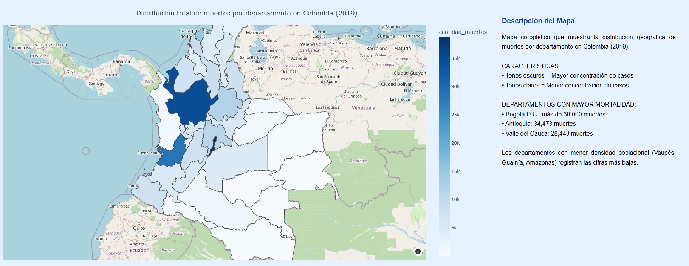
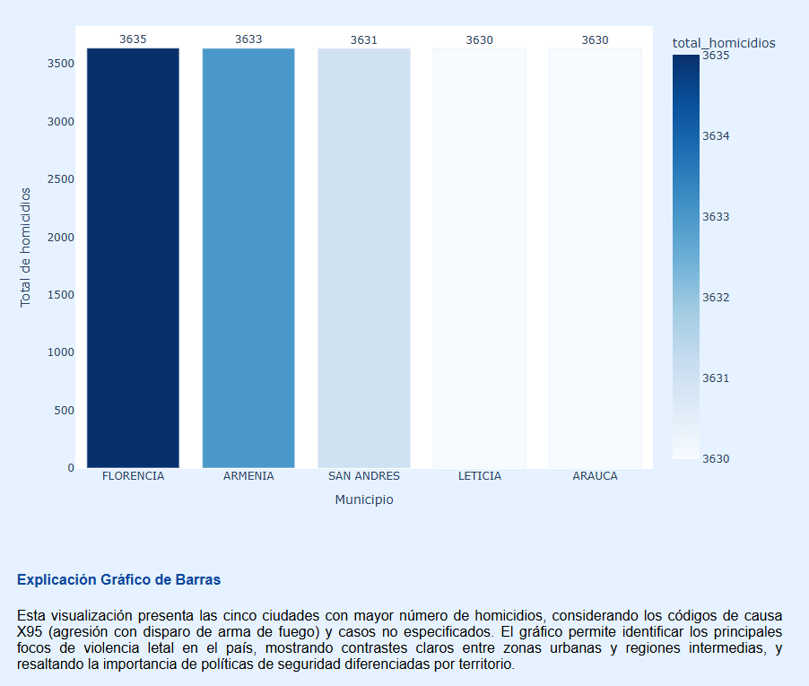
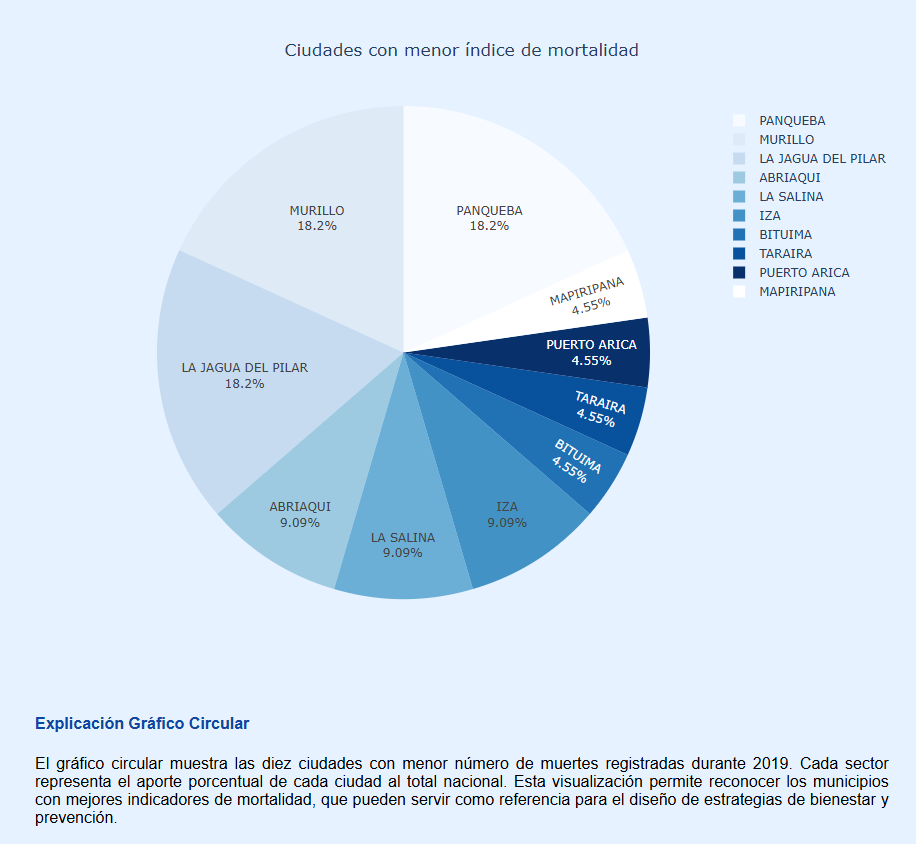
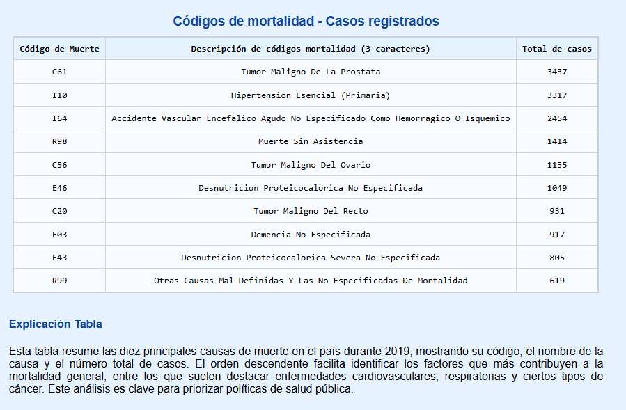
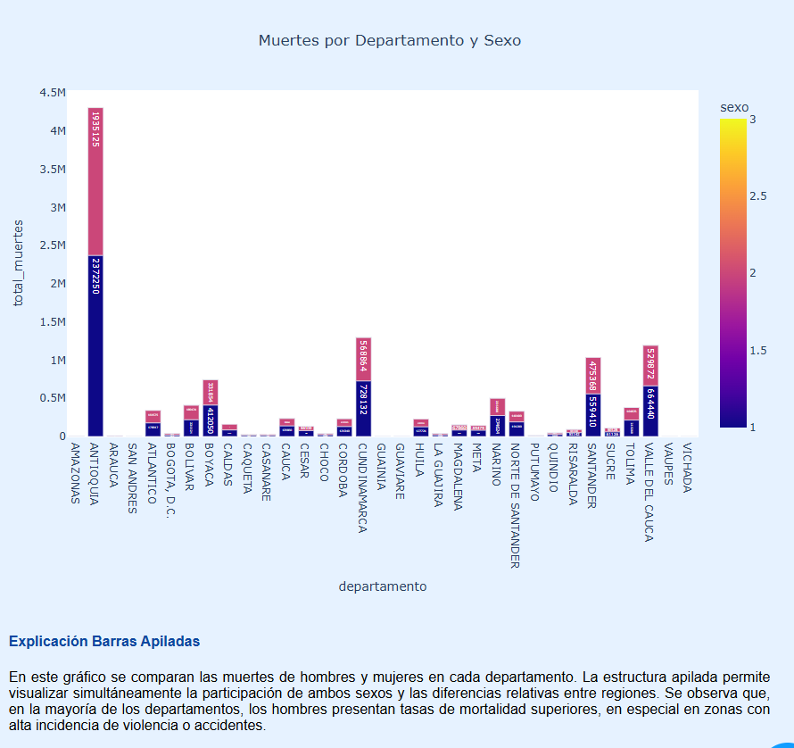
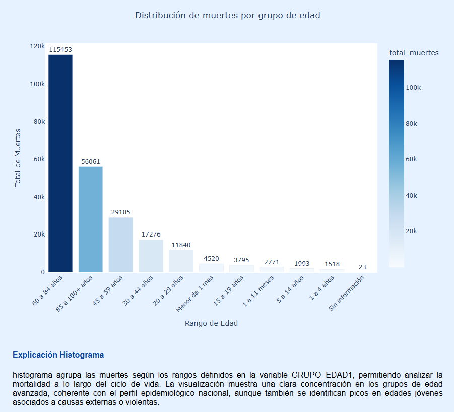

Análisis de Mortalidad en Colombia - 2019

##  Autores:
* Kiliam Alvarado
* Deiyiber Ducuara
##  Introducción del proyecto

Este proyecto desarrolla una aplicación web dinámica en Python con Dash y Plotly para analizar la mortalidad en Colombia durante el año 2019.
El objetivo principal es ofrecer una herramienta visual e interactiva que permita explorar patrones demográficos, causas de muerte y diferencias regionales, facilitando la comprensión de los datos estadísticos del **DANE (Estadísticas Vitales - EEVV 2019)**.

## Objetivo: 
El proyecto busca analizar los factores más relevantes asociados a la mortalidad en Colombia durante 2019, identificando:

* La distribución geográfica de las muertes.
* Las principales causas de fallecimiento.
* La variación mensual de las muertes.
* Las diferencias por sexo y grupo de edad.
* Los municipios con mayor y menor índice de mortalidad.

## Estructura del proyecto:
Este proyecto busca convertir los datos en conocimiento útil, brindando una experiencia visual que ayude a investigadores, analistas y ciudadanos a tomar decisiones basadas en evidencia.

├── info/

    ├── apiladas.csv
    ├── circular.csv
    ├── df_ciudades.csv
    ├── histogra.csv
    ├── lineal.csv
    ├── mapa.csv
    └── tablita.csv
├── Procfile

├── app.py

├── departamentos_colombia.geojson

├── extraer.ipynb

├── process.py

└── requirements.txt              
             

## Requisitos:
Se recomienda Python 3.10 o superior

**Librerías principales:**

dash==2.17.1
plotly==5.24.1
pandas==2.2.3
numpy==1.26.4
openpyxl==3.1.5
gunicorn==22.0.0  # Requerido para despliegue en 

**Instalación rápida:**

**pip install -r requirements.txt**

## Despliegue 
    1. Crear una cuenta en [Render](https://render.com).
    2. Conectar tu repositorio de GitHub.
    3. Crear un nuevo servicio web con los siguientes parámetros:
   * **Runtime:** Python
   * **Build Command:** pip install -r requirements.txt
   * **Start Command:** gunicorn app:server
    4. Esperar la compilación y copiar la **URL pública** generada.

---

## Instalación local

Para ejecutar la aplicación localmente:

    1. Clonar el repositorio git clone https://github.com/deiyiber/colombia-mortality-dashboard.git
    2. Entrar al directorio cd mortalidad_colombia_2019
    3. Instalar dependencias
    4. pip install -r requirements.txt

### Ejecutar la app
    python app.py
    Luego abre tu navegador en:
    http://127.0.0.1:8050

## Software:
* Lenguaje de programación: Python 3.10 base principal para el procesamiento de datos y desarrollo de la aplicación web.

* Libreria de visualización web: Dash permite construir interfaces web interactivas directamente en Python.

* Biblioteca gráfica: Plotly Express usada para generar gráficos dinámicos y mapas temáticos.

* Procesamiento de datos: Pandas utilizada para limpiar, transformar y analizar los datos de mortalidad.

* Despliegue en la nube: Render Plataforma utilizada para publicar la aplicación como servicio web (PaaS).

* Servidor WSGI: Gunicorn — necesario para ejecutar la aplicación en entornos de producción.

* Editor de codigo: Visual Studio Code 

* Instalación: Instrucciones para clonar el repositorio y ejecutar la aplicación localmente.

## Visualizaciones y resultados

La aplicación incluye los siguientes elementos interactivos:

### Mapa: Muertes por departamento

Representa el total de fallecimientos en cada departamento colombiano durante 2019, permitiendo identificar regiones críticas en mortalidad.

### Gráfico de líneas: Variación mensual

Muestra cómo varía el número de muertes a lo largo del año, revelando posibles estacionalidades o picos por causas específicas.

### Gráfico de barras: Ciudades más violentas

Visualiza las 5 ciudades con mayor número de homicidios (códigos X95 y relacionados).

### Gráfico circular: Ciudades con menor mortalidad

Permite explorar los municipios con menor índice de fallecimientos.

### Tabla: Principales causas de muerte

Lista las 10 causas más frecuentes, ordenadas de mayor a menor, incluyendo su código DANE.

### Barras apiladas: Muertes por sexo y departamento

Comparación del número total de muertes masculinas y femeninas por región.

### Histograma: Distribución por grupo de edad

Agrupa los fallecimientos según los códigos DANE (GRUPO_EDAD1), mostrando patrones de mortalidad a lo largo del ciclo de vida. 
